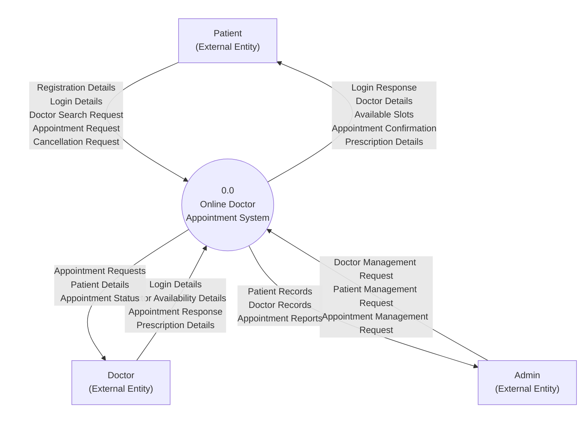
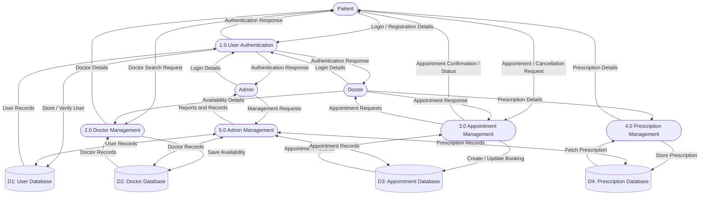
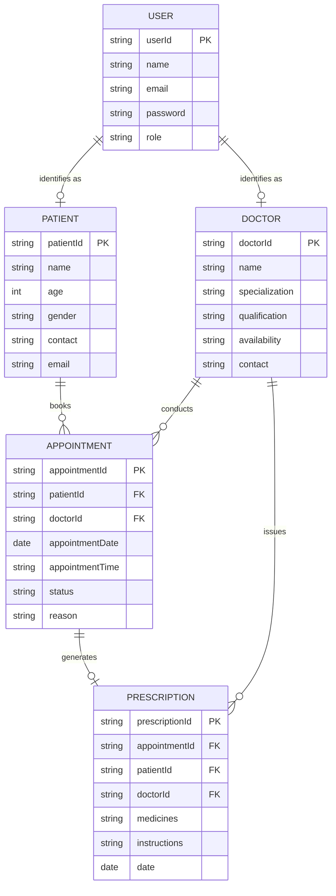

# Data Flow Diagrams and Data Dictionary

**Project:** Online Doctor Appointment System  
**Clinic:** MediCare Clinic (Kafiyabad, Moradabad, Uttar Pradesh, India)  
**Team Members:** Vishal Kashyap, Vishal Kumar, Shubham Mourya  
**Document Version:** 1.0  
**Date:** September 2026  

---

## 1. Introduction

This document provides a detailed description of the data flow and key data entities for the Online Doctor Appointment System developed for MediCare Clinic. It illustrates how information moves across users, system processes, and data stores, and defines the structural attributes of each core entity. 

This document serves as a dedicated companion to the main Software Requirements Specification (SRS) document, offering detailed analytical models (Level 0 DFD, Level 1 DFD, Entity Relationship Diagram, and Data Dictionary tables) without making the primary SRS document crowded or difficult to navigate.

---

## 2. Context Diagram / Level 0 DFD

The Context Diagram (Level 0 DFD) represents the complete Online Doctor Appointment System as a single centralized process interacting with external entities. It establishes the high-level boundary of the application, identifying all incoming inputs from users and outgoing outputs returned by the system.

### External Entities
* **Patient:** End-user seeking medical consultations, clinic information, and appointment booking.
* **Doctor:** Healthcare provider managing availability, reviewing appointment requests, and writing prescriptions.
* **Admin:** Clinic staff or administrator managing user accounts, doctor schedules, patient profiles, and operational reports.

### Data Flows Summary

* **Patient Sends to System:**
  * Registration Details
  * Login Details
  * Doctor Search Request
  * Appointment Request
  * Appointment Cancellation Request

* **System Sends to Patient:**
  * Login Response
  * Doctor Details
  * Available Appointment Slots
  * Appointment Confirmation
  * Prescription Details

* **Doctor Sends to System:**
  * Login Details
  * Doctor Availability Details
  * Appointment Response
  * Prescription Details

* **System Sends to Doctor:**
  * Appointment Requests
  * Patient Details
  * Appointment Status

* **Admin Sends to System:**
  * Doctor Management Request
  * Patient Management Request
  * Appointment Management Request

* **System Sends to Admin:**
  * Patient Records
  * Doctor Records
  * Appointment Reports

**Figure 1: Context Diagram / Level 0 DFD**

*Explanation:* Figure 1 presents the Level 0 Context Diagram with the Patient entity on the left, the Doctor entity on the right, the Admin entity at the bottom, and the central system process coordinating data exchange between all parties.

---

## 3. Level 1 DFD

The Level 1 Data Flow Diagram decomposes the main system into five key sub-processes and highlights interactions with external entities and four central data stores.

### Sub-Processes and Data Stores Overview
* **1.0 User Authentication:** Manages account registration, credential verification, and session responses.
* **2.0 Doctor Management:** Manages doctor profiles, qualifications, and consultation availability.
* **3.0 Appointment Management:** Handles booking requests, slot availability verification, and status updates.
* **4.0 Prescription Management:** Handles recording of prescriptions by doctors and retrieval by patients.
* **5.0 Admin Management:** Provides administrative control over patients, doctors, schedules, and clinic reports.

* **Data Stores:**
  * **D1: User Database:** Stores registered user credentials and account roles.
  * **D2: Doctor Database:** Stores doctor profiles, qualifications, and operating hours.
  * **D3: Appointment Database:** Stores scheduled dates, time slots, patient symptoms, and booking statuses.
  * **D4: Prescription Database:** Stores issued prescriptions, medications, and instructions.

### 3.1 User Authentication
* Handles patient, doctor, and admin registration and login.
* Validates submitted user credentials against stored records.
* Stores new user accounts and retrieves existing profiles from the User Database.
* Sends authentication responses (successful validation or error messages) back to the user.

### 3.2 Doctor Management
* Displays comprehensive doctor profiles, qualifications, and clinical experience.
* Supports searching and viewing available doctors and medical specialties.
* Manages doctor consultation shifts and working hours.
* Reads and updates doctor information using the Doctor Database.

### 3.3 Appointment Management
* Checks available appointment slots for specified consultation dates and shifts.
* Creates new appointment booking requests submitted by patients.
* Updates appointment status (Pending, Accepted, Rejected, or Cancelled).
* Supports appointment cancellation requested by patients or clinic staff.
* Uses the Appointment Database to persist and query booking records.

### 3.4 Prescription Management
* Allows the doctor to record and update patient prescriptions after a consultation.
* Allows patients to view issued prescriptions and dosage instructions online.
* Uses the Prescription Database for persistent record storage.

### 3.5 Admin Management
* Manages patient records and contact information.
* Manages doctor profiles and consultation parameters.
* Oversees all scheduled clinic appointments.
* Generates basic operational reports and clinic volume summaries.
* Uses the relevant databases (User, Doctor, Appointment, and Prescription databases) to execute administrative tasks.

**Figure 2: Level 1 Data Flow Diagram**

*Explanation:* Figure 2 illustrates the breakdown into 5 sub-processes, showing how data passes between external users, processes, and four primary data stores.

---

## 4. Entity Relationship Diagram

The proposed Entity Relationship (ER) Diagram presents the conceptual data model for the Online Doctor Appointment System, detailing the primary entities, attributes, and structural cardinality.

*Note: Since the existing project currently utilizes a Next.js frontend with client-side mock data structures, this ER Diagram represents a proposed relational schema designed for subsequent backend and database implementation.*

### Entities and Relationships
* **User:** Base entity for authentication, identified by user ID and associated with an account role (Patient, Doctor, or Admin).
* **Patient:** Represents a clinic patient. One Patient can have many Appointments.
* **Doctor:** Represents a clinic healthcare provider. One Doctor can have many Appointments.
* **Appointment:** Links a patient with a doctor for a scheduled date and time. One Appointment belongs to exactly one Patient and one Doctor.
* **Prescription:** Contains medical recommendations and prescribed drugs. One Appointment may have one Prescription, and a Doctor can create prescriptions for appointments.

**Figure 3: Proposed Entity Relationship Diagram**

*Explanation:* Figure 3 shows the relationships between User, Patient, Doctor, Appointment, and Prescription entities along with their key attributes.

---

## 5. Data Dictionary

The Data Dictionary defines each field, attribute name, and description across all major entities of the system.

### 5.1 User Data Dictionary

| Field | Description |
|---|---|
| userId | Unique identifier of the user |
| name | Full name of the user |
| email | Email address of the user |
| password | Encrypted user password |
| role | Patient, Doctor, or Admin |

### 5.2 Patient Data Dictionary

| Field | Description |
|---|---|
| patientId | Unique patient identifier |
| name | Patient’s full name |
| age | Patient’s age |
| gender | Patient’s gender |
| contact | Patient contact number |
| email | Patient email address |

### 5.3 Doctor Data Dictionary

| Field | Description |
|---|---|
| doctorId | Unique doctor identifier |
| name | Doctor’s full name |
| specialization | Doctor’s medical specialization |
| qualification | Doctor’s qualification |
| availability | Doctor’s available days and time |
| contact | Doctor contact details |

### 5.4 Appointment Data Dictionary

| Field | Description |
|---|---|
| appointmentId | Unique appointment identifier |
| patientId | ID of the patient booking the appointment |
| doctorId | ID of the selected doctor |
| appointmentDate | Date of the appointment |
| appointmentTime | Time of the appointment |
| status | Pending, Accepted, Rejected, Cancelled, or Completed |
| reason | Reason for the appointment |

### 5.5 Prescription Data Dictionary

| Field | Description |
|---|---|
| prescriptionId | Unique prescription identifier |
| appointmentId | Related appointment identifier |
| patientId | Patient receiving the prescription |
| doctorId | Doctor issuing the prescription |
| medicines | Prescribed medicines |
| instructions | Doctor’s instructions |
| date | Prescription date |

*Note: In accordance with project requirements, no Payment entity or payment-related fields are included because payment processing is not part of the project scope.*

---

## 6. Conclusion

The Data Flow Diagrams (DFDs) presented in this document demonstrate how information flows logically between external users (Patients, Doctors, Admins), primary functional processes, and underlying data stores. Complementing the process model, the Entity Relationship Diagram and Data Dictionary clearly establish the core data entities, attributes, and relational constraints of the system. Together, these specifications provide a structured analytical foundation that supports the main Software Requirements Specification and guides future database and backend integration.
