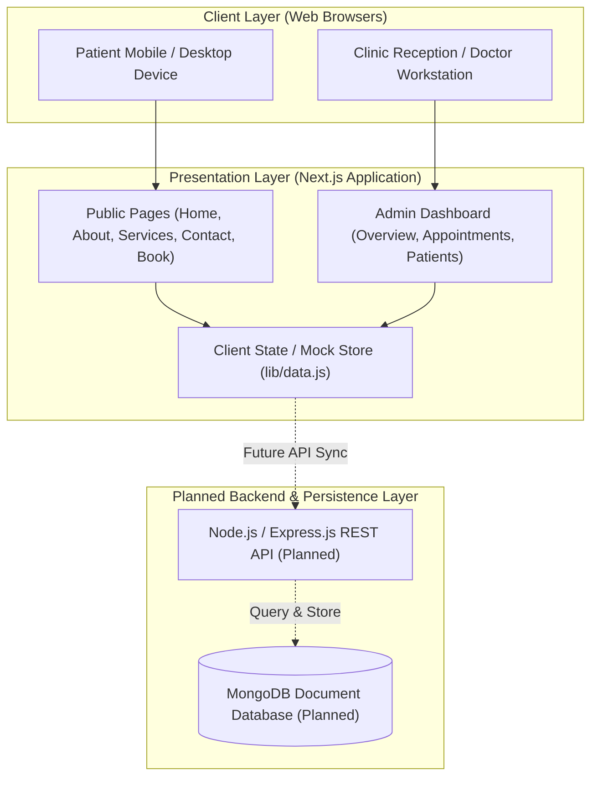
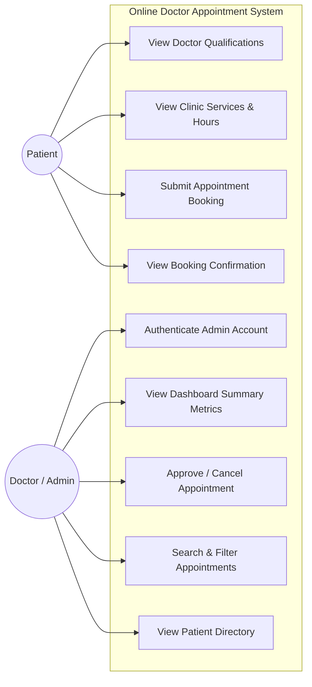
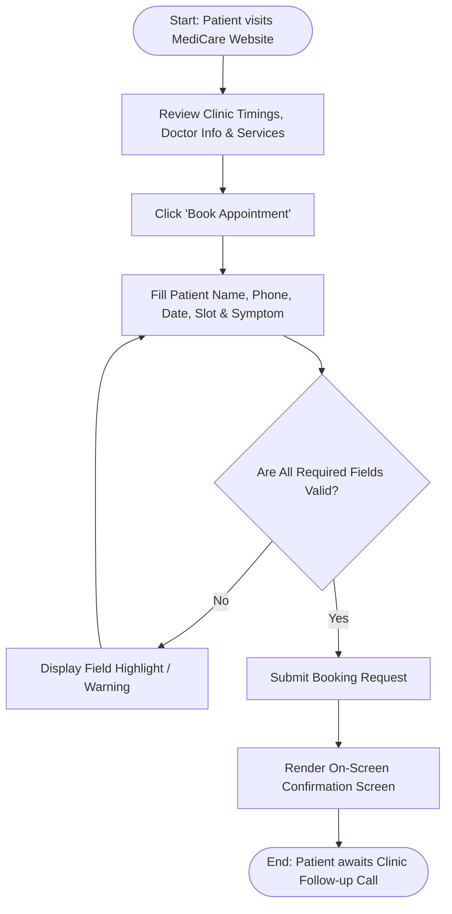
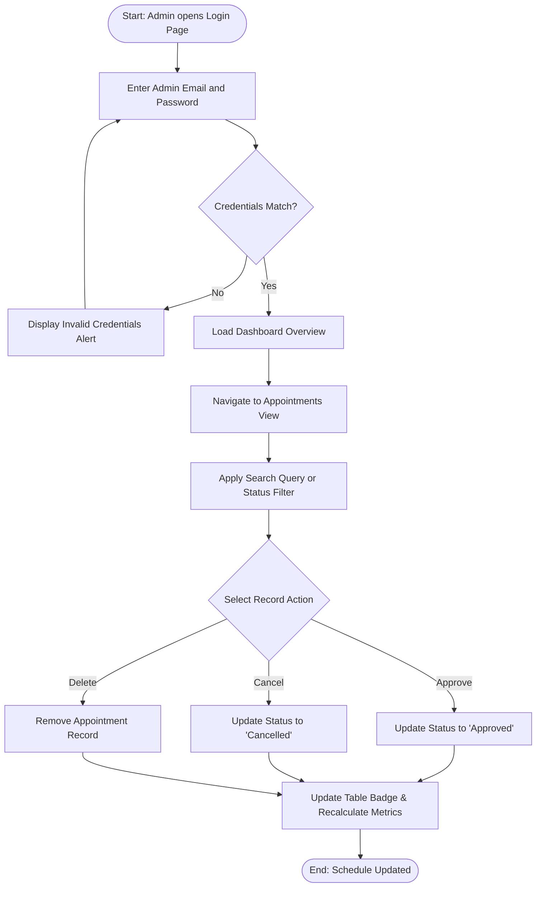
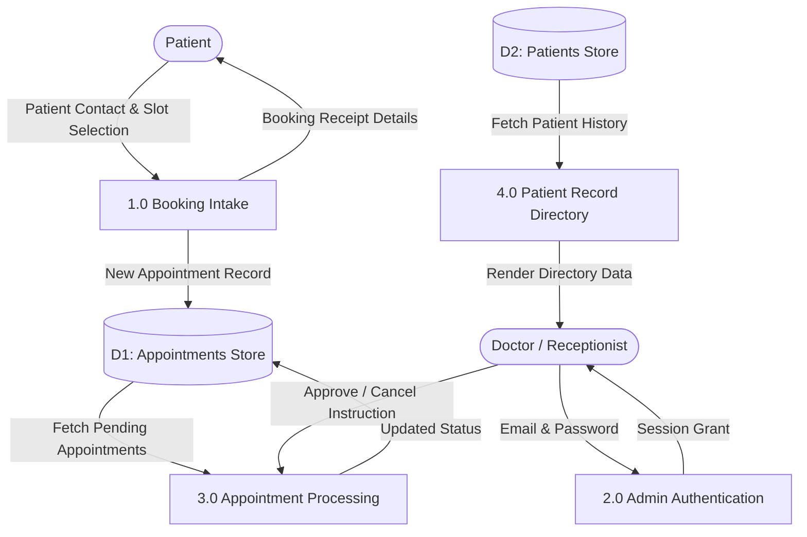

# Software Requirements Specification (SRS)

**Project:** Online Doctor Appointment System  
**Clinic:** MediCare Clinic (Kafiyabad, Moradabad, Uttar Pradesh, India)  
**Team Members:** Vishal Kashyap, Vishal Kumar, Shubham Mourya  
**Document Version:** 1.0  
**Standard:** IEEE 830-1998 Compatible  
**Date:** September 2026  

---

## 1. Introduction

### 1.1 Purpose
The purpose of this Software Requirements Specification (SRS) document is to provide a complete, formal description of the functional, non-functional, and interface requirements for the Online Doctor Appointment System built for MediCare Clinic. This specification defines the system behavior for patients and clinic administrators, establishing an explicit reference for software engineering evaluation, development verification, and system evolution.

### 1.2 Scope
The Online Doctor Appointment System is a web-based healthcare coordination application designed to digitize consultation booking and front-desk appointment administration. The system enables patients in and around Moradabad to inspect clinic information, review doctor qualifications, check clinical timings, and submit appointment requests online. Simultaneously, the platform provides clinic administrators (lead doctor and reception staff) with an administrative dashboard to review incoming requests, track patient records, and update appointment statuses.

The system does not include automated clinical diagnosis, telemedicine video streaming, pharmacy fulfillment, or insurance processing.

### 1.3 Intended Audience
This document is prepared for:
* **Academic Evaluators and Faculty:** To review architectural planning, requirement definition, and adherence to software engineering standards.
* **Project Developers:** Vishal Kashyap, Vishal Kumar, and Shubham Mourya, to guide component implementation and future backend integration.
* **Clinic Administrative Personnel:** To understand functional operations, workflows, and administrative controls.

### 1.4 Product Overview
MediCare Clinic currently manages appointments through walk-in inquiries and incoming telephone calls. This causes long lobby waiting times, front-desk telephone congestion, and occasional scheduling overlaps. The Online Doctor Appointment System provides a centralized digital alternative, consisting of a responsive public patient portal and a secure administrative dashboard.

### 1.5 Definitions and Acronyms

| Term / Acronym | Definition |
|---|---|
| SRS | Software Requirements Specification; formal document defining system capabilities. |
| UI | User Interface; visual elements through which users interact with the application. |
| API | Application Programming Interface; interface facilitating data transfer between software layers. |
| DB | Database; organized repository for storing persistent application records. |
| JWT | JSON Web Token; compact, URL-safe standard used for securely transmitting information between parties as a JSON object. |
| Admin | Administrator; authorized clinic staff or physician possessing management privileges on the dashboard. |
| Patient | An end-user visiting the clinic website to seek healthcare details or book an appointment. |

---

## 2. Overall Description

### 2.1 Product Perspective
The Online Doctor Appointment System operates as a responsive web platform. In its current implementation phase, the system operates as a Next.js 14 web application utilizing React client components and in-memory mock datasets for demonstration. The planned complete architecture envisions a full three-tier structure comprising a Next.js presentation layer, a Node.js/Express.js application backend, and a persistent MongoDB database layer.

### 2.2 Product Functions
The high-level functions of the system include:
* Presenting clinic credentials, Dr. Vishal Kashyap's profile, and operational schedules.
* Displaying medical service offerings and patient testimonials.
* Capturing patient appointment requests with date, slot, and symptom details.
* Providing immediate booking confirmation summaries.
* Authenticating clinic administrators through a dedicated login interface.
* Presenting dashboard summaries of daily and total appointment volumes.
* Filtering, approving, cancelling, and deleting appointment records.
* Displaying a patient history directory.

### 2.3 User Classes and Characteristics

| User Class | Role | Main Activities | Technical Knowledge |
|---|---|---|---|
| Patient | Service consumer | Browses doctor and service details; fills and submits appointment booking forms; reviews booking receipt. | Low to Moderate (standard smartphone and browser familiarity). |
| Doctor / Clinic Owner | Healthcare provider & supervisor | Reviews scheduled daily appointments; inspects patient symptoms; oversees queue volume. | Moderate (standard web and computer usage). |
| Clinic Staff / Receptionist | Front-desk operator | Monitors incoming booking requests; approves or cancels slots; searches patient contact details. | Moderate (basic office computer skills). |

### 2.4 Operating Environment
* **Client Side:** Modern web browsers including Google Chrome (v100+), Mozilla Firefox (v100+), Apple Safari (v15+), and Microsoft Edge (v100+) on desktop computers, laptops, tablets, and smartphones.
* **Server Side:** Node.js runtime environment (v18 or higher) on any standard hosting environment (Linux, Windows Server, Vercel, or cloud compute).
* **Database (Planned):** MongoDB Community Server or MongoDB Atlas cloud database.

### 2.5 Design and Implementation Constraints
* The application must operate across standard mobile screen widths (320px minimum) without breaking visual layouts.
* The current release utilizes client-side state handling and mock datasets; persistent storage is reserved for subsequent backend development.
* Third-party software dependencies must be minimized to lightweight, well-maintained packages (`lucide-react`, `clsx`, `tailwindcss`).
* No external paid API services (SMS gateways or payment gateways) are required for baseline academic evaluation.

### 2.6 Assumptions and Dependencies
* Users possess an active internet connection and a web browser with JavaScript enabled.
* Clinic administrative staff have access to at least one computer or tablet device with an internet connection at the reception desk.
* All displayed clinic information (Dr. Vishal Kashyap, Moradabad address, consultation hours) remains current.

---

## 3. Functional Requirements

The functional requirements are systematically categorized and designated with unique identifiers (FR-01 through FR-14):

| ID | Functional Requirement | Detailed Description | Priority |
|---|---|---|---|
| FR-01 | View Doctor Information | The system shall present doctor qualifications (MBBS, MD), clinical experience (5+ years), specialization, and biographical summary. | High |
| FR-02 | View Clinic Services | The system shall provide a detailed list of clinical services (General Checkup, Dermatology, Child Specialist, Diabetes Care, Heart & BP, Emergency Care). | High |
| FR-03 | View Clinic Timings | The system shall display regular consultation shifts for Monday–Friday, Saturday, and Sunday (morning and evening). | High |
| FR-04 | View Clinic Location / Contact | The system shall display the physical address (Kafiyabad, Moradabad, Uttar Pradesh), phone number (+91 95685 49366), and inquiry form. | High |
| FR-05 | Book Appointment | The system shall allow patients to input their name, contact phone number, optional email, desired date, time slot, and health concern. | High |
| FR-06 | Appointment Form Validation | The system shall validate mandatory fields, block submissions without a time slot, and prevent past date selections. | High |
| FR-07 | Store Appointment Information | The system shall register submitted appointment details in state memory (and route them to persistent storage in the planned backend). | High |
| FR-08 | Admin Login | The system shall provide a secure login page validating administrative email and password credentials. | High |
| FR-09 | Admin Dashboard | The system shall provide an administrative control panel displaying summary metrics and recent booking activities. | High |
| FR-10 | View Appointments | The system shall render a comprehensive table of appointments showing patient name, phone, appointment date/time, concern, and status. | High |
| FR-11 | View Patient Information | The system shall present a directory of registered patients containing contact numbers, email addresses, total visits, and primary conditions. | Medium |
| FR-12 | Approve / Reject Appointments | The system shall allow administrators to transition an appointment status between 'Approved' and 'Cancelled' via interactive buttons. | High |
| FR-13 | Update Appointment Status | The system shall instantly reflect appointment status changes across UI tables and dashboard numerical counters. | High |
| FR-14 | Dashboard Statistics | The system shall calculate and display aggregated counts: Total Appointments, Pending Inquiries, Approved Visits, and Total Patient Profiles. | High |

---

## 4. Non-Functional Requirements

The non-functional qualities and constraints governing system operation are defined below:

| ID | Requirement Category | Description | Priority |
|---|---|---|---|
| NFR-01 | Usability | The user interface shall feature clear visual hierarchy, accessible contrast ratios, and intuitive form inputs requiring no user training. | High |
| NFR-02 | Performance | Web pages shall load and become interactive in under 1.5 seconds on standard broadband connections. Client-side state transitions shall occur in under 200 milliseconds. | High |
| NFR-03 | Security | Administrative dashboard routes shall be restricted to authenticated sessions. Passwords shall be masked on input. | High |
| NFR-04 | Reliability | The system shall operate stably without runtime JavaScript exceptions during form submissions, filtering, and status changes. | High |
| NFR-05 | Availability | The web application shall maintain high availability during standard clinic operating hours when hosted on reliable web server infrastructure. | Medium |
| NFR-06 | Responsiveness | The layout shall be fluid and responsive, supporting screen resolutions from 320px (mobile) to 1920px (full HD desktop) without horizontal scrolling. | High |
| NFR-07 | Maintainability | Codebase shall adhere to modular Next.js App Router conventions with separate folders for layouts, UI components, and mock data. | Medium |
| NFR-08 | Scalability | The application architecture shall allow straightforward replacement of client-side state arrays with REST API service calls and a database. | Medium |

---

## 5. External Interface Requirements

### 5.1 User Interface
* **Public Patient Portal:** Designed with a clean medical color palette (teal/emerald tones, soft slates, white backgrounds). Includes clear top navigation (`Home`, `About`, `Services`, `Appointment`, `Contact`, `Admin Login`) and a comprehensive footer with location and emergency contact details.
* **Administrative Dashboard:** Designed with an administrative sidebar navigation (`Dashboard Overview`, `Appointments`, `Patients`, `Settings`, `Sign Out`), metric summary cards, tabbed status filters (`All`, `Pending`, `Approved`, `Cancelled`), and tabular data grids with contextual action buttons.

### 5.2 Hardware Interface
* The system requires no specialized clinical hardware. Standard input/output devices (monitors, keyboards, touchscreens, mobile displays) are supported through standard browser rendering engines.

### 5.3 Software Interface
* **Operating Systems:** Compatible with Windows 10/11, macOS, Linux, Android, and iOS via browser execution.
* **Node.js Environment:** Server environment running Node.js v18.x or v20.x with Next.js 14 framework.
* **Planned Database Interface:** Mongoose Object Data Modeling (ODM) library connecting to MongoDB 6.0+.

### 5.4 Communication Interface
* Web communication utilizes standard HTTP/HTTPS protocols for serving assets and API requests.
* Planned future notification modules will interface with SMTP email protocols and REST-based SMS messaging gateways.

---

## 6. Other Requirements

### 6.1 Security Requirements
* Administrative authentication must enforce credential validation before rendering dashboard data views.
* Client-side inputs must be sanitized to guard against Cross-Site Scripting (XSS) and injection vulnerabilities upon future database connection.
* Planned production deployments must transmit data exclusively over TLS/HTTPS encrypted channels.

### 6.2 Database Requirements
* The planned database schema must enforce referential integrity between appointment bookings and patient master profiles.
* Fields such as patient phone numbers and appointment timestamps must be indexed to facilitate fast search queries.

### 6.3 Privacy Considerations
* Patient health concerns and contact numbers must be treated as confidential medical data and restricted from public listing.
* No patient medical data shall be sold or transmitted to third-party tracking services.

### 6.4 Future Requirements
* Integration of automated SMS or WhatsApp confirmation notices upon appointment status updates.
* Multi-doctor support allowing multiple physicians to maintain individual schedules within the same clinic dashboard.
* Patient self-service cancellation through a unique booking reference code.

---

## 7. System Models and Diagrams

### 7.1 System Architecture
**Figure 1: High-Level System Architecture Diagram**

*Explanation:* Figure 1 illustrates the tiered system architecture. Currently, patient and administrative user interfaces communicate with Next.js page routes and state models (`lib/data.js`). The dotted connections represent the planned expansion into an Express.js REST API and persistent MongoDB database.

---

### 7.2 Use Case Diagram
**Figure 2: System Use Case Diagram**

*Explanation:* Figure 2 depicts primary interactions. Patients interact with public informational pages and submit booking requests, while clinic administrators access protected management operations after authentication.

---

### 7.3 Patient Appointment Flow
**Figure 3: Patient Booking Flowchart**

*Explanation:* Figure 3 outlines the sequential steps taken by a patient from initial website access to form validation and on-screen receipt rendering.

---

### 7.4 Admin Appointment Flow
**Figure 4: Administrative Management Flowchart**

*Explanation:* Figure 4 shows administrative authentication followed by status manipulation and immediate UI synchronization on the dashboard.

---

### 7.5 Basic Data Flow Diagram (DFD Level 1)
**Figure 5: Data Flow Diagram (Level 1)**

*Explanation:* Figure 5 demonstrates data flow across functional processes and data stores for both patient bookings and administrative management.

---

## 8. Requirement Prioritization

Requirements are prioritized according to the MoSCoW standard:

### 8.1 Must Have Requirements
* Comprehensive public web pages detailing Dr. Vishal Kashyap, medical services, clinic hours, and Moradabad location.
* Functional appointment booking form with phone validation, mandatory slot picking, and future-date restriction.
* On-screen booking confirmation card.
* Administrative login screen with authentication barrier.
* Interactive appointments management table with approve, cancel, and delete controls.
* Summary statistics counters on the dashboard.

### 8.2 Should Have Requirements
* Patient master directory with visit count tracking.
* Real-time search by patient name and phone number.
* Tab-based status filtering for appointments (`All`, `Pending`, `Approved`, `Cancelled`).
* Public contact inquiry form.

### 8.3 Could Have Requirements
* Printable appointment slips for patient records.
* Export feature for daily clinic schedules.
* Visual indicators for recurring patients.

### 8.4 Future Requirements
* Production MongoDB database connection with Mongoose ODM models.
* Express.js REST API endpoints replacing local mock state.
* Token-based authentication using JWT stored in secure HTTP-only cookies.
* Automated SMS notification delivery upon appointment confirmation.

---

## 9. Acceptance Criteria

| Feature Area | Acceptance Criteria Specification |
|---|---|
| Public Information Pages | Navigation links must route correctly to `/`, `/about`, `/services`, and `/contact`. All clinic information must display without broken styles or text overflow. |
| Appointment Form | Missing mandatory fields (Full Name, Phone, Preferred Date, Preferred Time, Health Concern) must prevent submission and display user prompts. |
| Time Slot Selection | The form must present selectable time slot buttons; submission must be disabled until a valid slot is chosen. |
| Date Boundary | The date picker must prohibit past date selection using standard HTML5 date constraints (`min` attribute). |
| Booking Confirmation Screen | Upon successful submission, an on-screen confirmation card must appear, showing patient name, chosen date, chosen time slot, and health concern. |
| Admin Authentication | Submitting `admin@medicare.com` with password `Admin@123` must route to `/dashboard`. Incorrect credentials must display an error banner. |
| Appointment Status Updates | In `/dashboard/appointments`, clicking 'Approve' must change the status pill to 'Approved' (green) and update dashboard counters. Clicking 'Cancel' must update the status to 'Cancelled' (red). |
| Search and Filtering | Typing letters into the search input must immediately filter rows by patient name or phone number. Clicking filter buttons must show only records matching that status. |
| Responsive Layout | The layout must adapt gracefully from mobile screens (360px) to desktop monitors (1920px) without overlapping text or broken grids. |

---

## 10. Appendices

### Appendix A — Technology Stack

| Component | Technology | Implementation Classification | Purpose |
|---|---|---|---|
| Presentation Layer | Next.js 14 (App Router) | Implemented | Modern server-side and client-side page rendering. |
| UI Components | React.js 18 | Implemented | Modular component architecture and state hooks. |
| Styling Engine | Tailwind CSS 3 | Implemented | Utility-first responsive CSS styling. |
| Vector Icons | Lucide React | Implemented | Clean, consistent icons for medical and administrative UI. |
| Development Server | Node.js | Implemented | Local compilation and development environment. |
| Backend Server | Express.js | Planned | RESTful API service to manage business operations. |
| Database Engine | MongoDB | Planned | NoSQL document storage for persistent data records. |
| Auth Security | JWT / bcrypt | Planned | Secure password hashing and tokenized authorization. |

### Appendix B — Planned API List

*Note: In the current project phase, all state is handled within client components. The following REST API endpoints are planned for the production backend:*

| Endpoint Path | HTTP Method | Implementation Status | Intended Operation |
|---|---|---|---|
| `/api/appointments` | GET | Planned API | Retrieve all appointment records with optional status filtering. |
| `/api/appointments` | POST | Planned API | Submit and record a new patient appointment request. |
| `/api/appointments/:id` | PATCH | Planned API | Update appointment status (e.g., mark as approved or cancelled). |
| `/api/appointments/:id` | DELETE | Planned API | Remove an appointment record from the system. |
| `/api/patients` | GET | Planned API | Retrieve registered patient profiles and visit history. |
| `/api/auth/login` | POST | Planned API | Authenticate administrative credentials and issue a JWT token. |
| `/api/dashboard/stats` | GET | Planned API | Fetch aggregated counts for dashboard metric cards. |

### Appendix C — Database Fields

#### Confirmed Frontend Data Model (Implemented in `lib/data.js`)
The existing application utilizes the following structure for mock appointment and patient records:

* **Appointment Object:**
  * `id` (Number): Unique identifier
  * `name` (String): Full name of the patient
  * `phone` (String): Contact phone number
  * `date` (String, YYYY-MM-DD): Requested appointment date
  * `time` (String): Selected time slot (e.g., "10:00 AM")
  * `problem` (String): Medical concern or symptoms
  * `status` (String): Current booking status (`pending`, `approved`, `cancelled`)

* **Patient Object:**
  * `id` (Number): Unique identifier
  * `name` (String): Full name of the patient
  * `phone` (String): Contact phone number
  * `email` (String): Contact email address
  * `visits` (Number): Total completed visits
  * `lastVisit` (String): Formatted date of last consultation
  * `condition` (String): Primary diagnosed medical condition

#### Proposed MongoDB Schema (Planned for Production)
* **Appointments Collection:**
  * `_id`: ObjectId (Primary Key)
  * `patientName`: String (Required, Trimmed)
  * `patientPhone`: String (Required, Indexed)
  * `patientEmail`: String (Optional)
  * `appointmentDate`: Date (Required)
  * `timeSlot`: String (Required)
  * `healthConcern`: String (Required)
  * `status`: String (Enum: `pending`, `approved`, `cancelled`, Default: `pending`)
  * `createdAt`: Date (Timestamp)
  * `updatedAt`: Date (Timestamp)

* **Patients Collection:**
  * `_id`: ObjectId (Primary Key)
  * `fullName`: String (Required)
  * `phone`: String (Required, Unique, Indexed)
  * `email`: String (Optional)
  * `totalVisits`: Number (Default: 1)
  * `lastVisitDate`: Date
  * `medicalNotes`: String
  * `createdAt`: Date (Timestamp)

### Appendix D — Glossary

* **App Router:** The routing architecture introduced in Next.js that leverages React Server Components and nested layouts.
* **Component:** A self-contained, reusable piece of user interface code written in React.js.
* **Client Component:** A Next.js component indicated with `'use client'` that executes in the browser and handles interactive state.
* **Local State:** Component-level memory managed using React hooks (`useState`) that exists while the session is active.
* **MoSCoW Method:** A requirement prioritization technique categorizing deliverables into Must Have, Should Have, Could Have, and Won't Have (Future).
* **NoSQL Database:** A non-relational database (such as MongoDB) that stores data in flexible, JSON-like documents.
* **Token-Based Authentication:** A security mechanism where a server issues a signed token (JWT) upon successful login, which the client presents for authorized requests.
