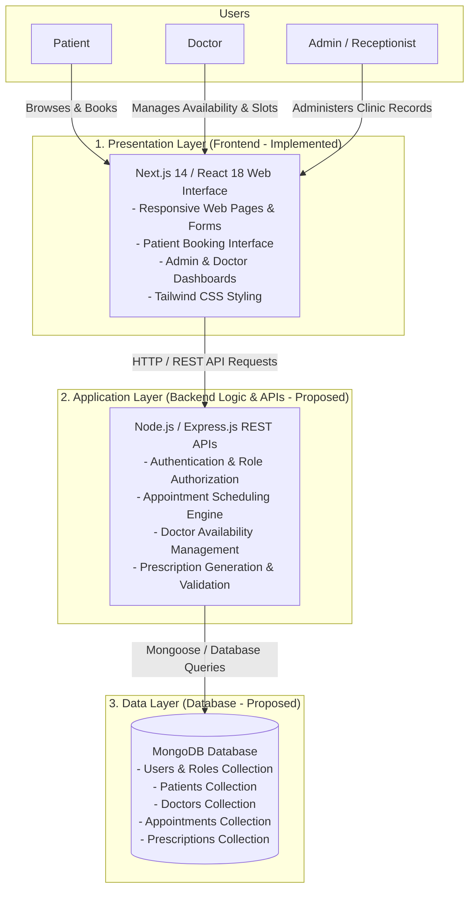
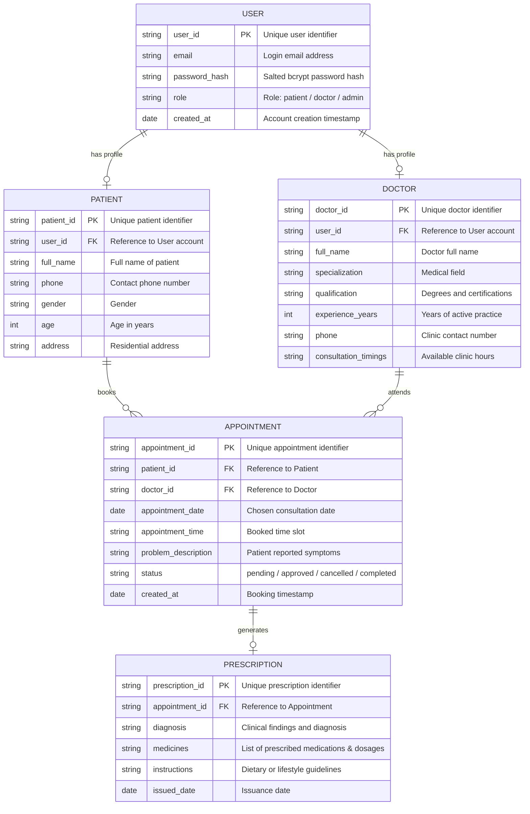
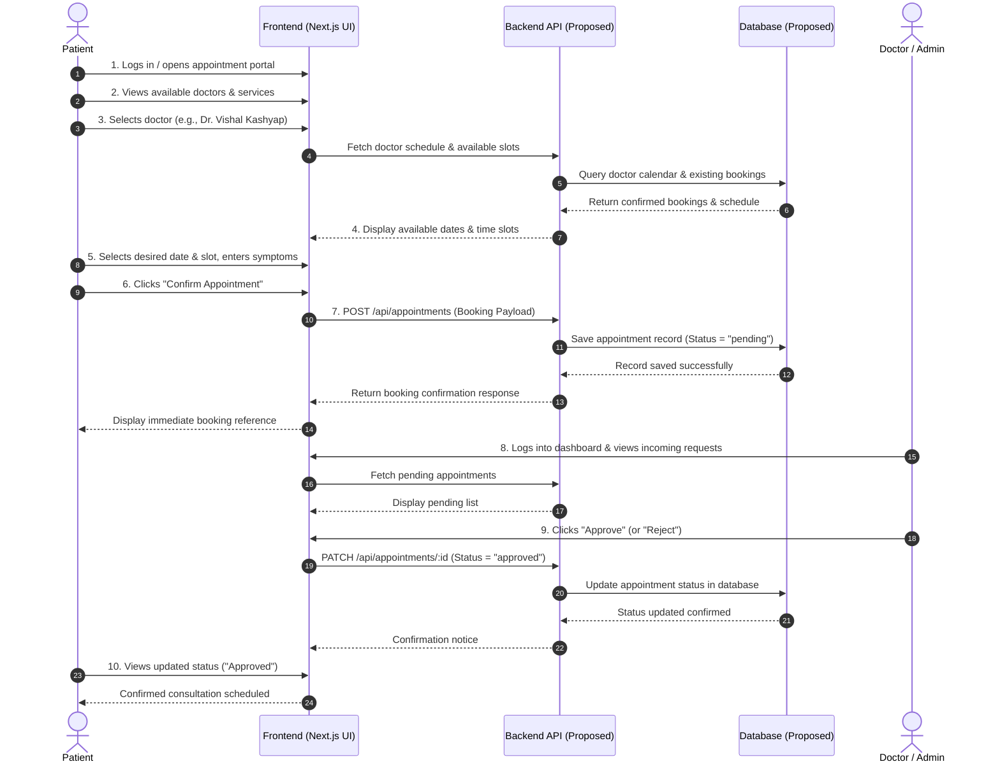
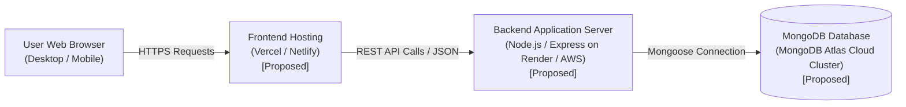

# System Design
## Online Doctor Appointment System

**Project:** Online Doctor Appointment System  
**Clinic:** MediCare Clinic (Kafiyabad, Moradabad, Uttar Pradesh, India)  
**Document Version:** 1.0  
**Status:** System Design Specification (College Project Standard)  
**Date:** September 2026  

---

## 1. Introduction

The purpose of this System Design Document is to describe the architectural, modular, data, and interface design for the **Online Doctor Appointment System** developed for MediCare Clinic. This document serves as a technical blueprint for students, software engineering evaluators, and developers to understand the structural organization of the software, the separation of responsibilities across different tiers, and the proposed interactions between the system components.

The Online Doctor Appointment System is designed to help patients find qualified doctors, check their operational schedules and availability, book appointments online, and review their appointment status and medical records. For healthcare providers (doctors), the system provides dedicated tools to view incoming appointment requests, accept or reject bookings, manage consultation schedules, and issue digital prescriptions. For clinic administrators, the platform centralizes the administration of patient lists, doctor schedules, and overall clinic booking workflows, reducing front-desk chaos and paperwork.

---

## 2. System Objectives

The primary objectives of the Online Doctor Appointment System are:

* **Provide an Easy Appointment Booking Process:** Enable patients to search for medical specialties, view doctor profiles, select convenient time slots, and submit consultation bookings effortlessly through a modern web interface.
* **Reduce Manual Appointment Management:** Eliminate paper registers, walk-in congestion, and repetitive phone calls by automating schedule tracking and appointment confirmations.
* **Allow Patients to View Doctor Information:** Display comprehensive doctor profiles, including qualifications, clinical experience, specializations, consultation fees, and visiting hours.
* **Allow Doctors to Manage Appointment Requests:** Give doctors immediate visibility into daily appointments, allowing them to accept, reschedule, or cancel requests based on clinical availability.
* **Maintain Organized Patient, Doctor, and Appointment Records:** Securely store structured records for patient visit histories, doctor credentials, and past/upcoming appointment details.
* **Improve Communication Between Patients and Doctors:** Streamline communication through transparent status updates (pending, approved, completed, cancelled) and clear prescription sharing.

---

## 3. System Architecture

The Online Doctor Appointment System follows a standard **Three-Tier Architecture** model. This architectural pattern separates user interaction, business rules, and persistent storage into distinct layers, ensuring modularity, scalability, and ease of maintenance.

### 3.1 Presentation Layer (Frontend)
The presentation layer is the top level of the system and directly interacts with the end users.
* **Frontend Interface:** Built with Next.js and React.js to provide server-rendered and client-interactive web pages.
* **Patient, Doctor, and Admin Dashboards:** Dedicated dashboard views displaying tailored metrics, appointment cards, and action panels for each user role.
* **Forms and Pages:** Interactive forms for patient appointment booking, admin/staff login, service browsing, and doctor schedule inspection.
* **Responsive User Interface:** Styled using Tailwind CSS to adapt cleanly across mobile phones, tablets, laptops, and desktop screens.
* *Implementation Note:* The frontend user interface, layout, and styling are **implemented** in the current project prototype.

### 3.2 Application Layer (Backend Logic & APIs - Proposed)
The application layer acts as the middle tier that coordinates application logic, performs calculations, validates user input, and handles transactions between the presentation layer and the database.
* **Backend Logic:** Core business rules governing appointment slot allocation, conflict avoidance, and status updates.
* **Authentication:** Token-based authentication verifying user identity and session validity.
* **Appointment Processing:** Business routines to validate available time slots and avoid double bookings.
* **Doctor Availability Management:** Logic to manage weekly clinic timings and custom leave schedules.
* **Prescription Management:** Processing doctor diagnoses, medication regimens, and patient access.
* **API Handling:** RESTful API endpoints handling JSON payloads for client requests.
* *Implementation Note:* In the current prototype, basic page routing and mock state exist in Next.js; full dedicated backend Express/Node APIs are **proposed** for upcoming development phases.

### 3.3 Data Layer (Database - Proposed)
The data layer is responsible for persistent storage, retrieval, and integrity of all system information.
* **Database Management System:** Document-oriented database (MongoDB) storing data in JSON-like documents.
* **User Records:** Authentication credentials, email addresses, and security roles.
* **Patient Records:** Patient demographic details, contact information, and medical histories.
* **Doctor Records:** Physician bios, qualifications, specializations, and daily consultation schedules.
* **Appointment Records:** Unique appointment timestamps, booked slots, patient complaints, and statuses.
* **Prescription Records:** Diagnoses, prescribed medications, dosage instructions, and issuance dates.
* *Implementation Note:* In the current prototype, data is simulated using mock objects in `src/lib/data.js`; persistent MongoDB storage is **proposed**.

### Proposed Technology Stack Summary
* **Frontend:** Next.js / React.js (*Implemented*)
* **Styling:** Tailwind CSS (*Implemented*)
* **Language:** JavaScript (ES6+) (*Implemented*)
* **Backend:** Node.js / Express.js (*Proposed*)
* **Database:** MongoDB with Mongoose ODM (*Proposed*)
* **Authentication:** JWT (JSON Web Tokens) with bcrypt password hashing (*Proposed*)
* **Version Control:** Git and GitHub (*Implemented*)

---

## 4. System Modules

The system is partitioned into four major modules according to user roles and core responsibilities:

### 4.1 Patient Module
This module contains all features accessible to patients seeking clinical guidance and consultations:
* **Registration (*Proposed*):** Allows new patients to create an account with name, contact, age, and password.
* **Login (*Proposed*):** Authenticates registered patients to manage their bookings.
* **Search and View Doctors (*Implemented*):** Enables browsing clinic doctors, specialties, and qualifications on public pages.
* **View Doctor Details (*Implemented*):** Shows doctor bio, degrees, contact information, and clinic timings.
* **Check Available Slots (*Implemented in UI / Proposed in DB*):** Displays time slots (e.g., Morning 9:00 AM – 1:00 PM, Evening 5:00 PM – 7:00 PM).
* **Book Appointments (*Implemented in UI / Mock Data*):** Form allowing patients to submit their name, phone, chosen date, preferred slot, and symptom description.
* **View Appointments (*Implemented in UI / Proposed for Personal Patient Portal*):** Allows patients to track whether their booking is pending, approved, or completed.
* **Cancel Appointments (*Proposed for Patient Portal*):** Enables patients to cancel an upcoming appointment ahead of time.
* **View Prescriptions (*Proposed*):** Lets patients download or review prescriptions generated after their doctor visit.

### 4.2 Doctor Module
This module provides healthcare professionals with the tools to manage their schedule and consultations:
* **Login (*Implemented as Clinic Login / Proposed as Role-Specific Login*):** Secure access to doctor management views.
* **View Appointment Requests (*Implemented in Dashboard*):** Doctor can view pending, approved, and cancelled appointments with patient names, symptoms, and dates.
* **Accept or Reject Appointments (*Implemented in UI State*):** Interactive buttons allowing the doctor to approve or decline incoming bookings.
* **Manage Availability (*Implemented in Settings UI / Proposed for DB Persistence*):** Controls to update working days and consultation hours.
* **View Patient Details (*Implemented in Dashboard*):** Listing of registered clinic patients, past visit dates, and ongoing conditions.
* **Add or Update Prescriptions (*Proposed*):** Form for doctors to input diagnosis notes and medications for completed appointments.

### 4.3 Admin Module
This module enables clinic front-desk administrators and supervisors to oversee operational activities:
* **Login (*Implemented*):** Staff login portal verifying administrator credentials.
* **Manage Patients (*Implemented in UI*):** Directory of registered clinic patients, search filters, and profile details.
* **Manage Doctors (*Implemented in UI / Proposed for Multi-Doctor Expansion*):** Profile management, doctor availability oversight, and contact configurations.
* **Manage Appointments (*Implemented in Dashboard*):** Comprehensive administrative view to filter, approve, reject, or delete appointment records.
* **View Basic Reports (*Implemented in Dashboard Summary Cards*):** Key metric widgets showing Total Appointments, Pending Inquiries, Approved Visits, and Total Patients.

### 4.4 Authentication Module
This module enforces identity verification and role-based permissions:
* **Registration (*Proposed*):** Secure sign-up validation for new users.
* **Login (*Implemented as Prototype Staff Login / Full JWT Proposed*):** Form collecting credentials and validating access.
* **Role-Based Access (*Proposed*):** Route guards ensuring patients, doctors, and admins access only their authorized views.
* **Logout (*Implemented in Dashboard*):** Clears user sessions and returns the user to the public home page.
* **Password Protection (*Proposed*):** Hashing passwords with salted bcrypt encryption before storage.

---

## 5. Technology Stack

The table below outlines the technologies utilized in the Online Doctor Appointment System along with their specific purpose and current implementation status in the project:

| Layer | Technology | Purpose | Current Status |
|---|---|---|---|
| **Frontend** | Next.js 14 / React 18 | Client user interface, routing, component rendering | **Implemented** |
| **Styling** | Tailwind CSS v3 | Utility-first responsive styling and modern layout design | **Implemented** |
| **Icons & UI Utilities** | Lucide React, clsx | Modern visual iconography and conditional styling | **Implemented** |
| **Backend Logic** | Node.js / Express.js | Server-side business logic, routing, and REST APIs | **Proposed** (Prototype currently uses Next.js client state and mock datasets) |
| **Database** | MongoDB | Document database for storing users, appointments, and doctors | **Proposed** (Prototype currently utilizes in-memory mock records in `src/lib/data.js`) |
| **Authentication** | JWT (JSON Web Tokens) & bcrypt | Cryptographic token sessions and password hashing | **Proposed** (Prototype uses client-side credential verification) |
| **Version Control** | Git and GitHub | Source code tracking, branch collaboration, and repository storage | **Implemented** |

---

## 6. Database Design

For the production version of the Online Doctor Appointment System, a document-oriented database model (MongoDB) is planned. The system schema is designed around five core entities: **User**, **Patient**, **Doctor**, **Appointment**, and **Prescription**.

### 6.1 Proposed Entities Overview

| Entity | Purpose |
|---|---|
| **User** | Stores global authentication credentials, account email, hashed password, and role (`patient`, `doctor`, `admin`). |
| **Patient** | Stores patient demographic information, contact number, age, gender, and medical background. |
| **Doctor** | Stores physician credentials, qualifications, specialization, department, phone, and weekly schedule. |
| **Appointment** | Stores individual booking records, scheduled date, time slot, patient symptoms, and booking status. |
| **Prescription** | Stores medical consultation outcomes, clinical diagnoses, prescribed medicines, and doctor notes. |

### 6.2 Entity Relationships

The relational business rules connecting the entities are:
* **Patient to Appointment:** One patient can have many appointments across different dates (*1 to N*).
* **Doctor to Appointment:** One doctor can have many scheduled appointments (*1 to N*).
* **Appointment Ownership:** Each appointment belongs strictly to one patient and one doctor (*N to 1*).
* **Appointment to Prescription:** One completed appointment may be associated with exactly one prescription record (*1 to 1 or 1 to 0*).
* **User to Role Profile:** One user account maps to either one patient profile, one doctor profile, or an administrator role.

### 6.3 Entity-Relationship (ER) Diagram

---

## 7. API Design

The system communicates between the presentation layer and application layer using standard HTTP methods and JSON payloads. The table below represents the **Proposed API Design** for full backend integration.

> **Status Notice:** The endpoints listed below represent the **Proposed API Design** for upcoming backend development with Node.js/Express.js or Next.js route handlers. In the current demonstration prototype, API requests are simulated using client-side React handlers and mock files.

| Method | Endpoint | Purpose | User Access | Status |
|---|---|---|---|---|
| `POST` | `/api/auth/register` | Register a new user account (Patient/Doctor) | Public (New Users) | **Proposed** |
| `POST` | `/api/auth/login` | Authenticate user credentials and return JWT token | All Users | **Proposed** |
| `GET` | `/api/doctors` | Retrieve a list of all active doctors and specializations | Public / Patient | **Proposed** |
| `GET` | `/api/doctors/:id` | Retrieve comprehensive profile and timings for a doctor | Public / Patient | **Proposed** |
| `POST` | `/api/appointments` | Create a new appointment booking request | Patient | **Proposed** |
| `GET` | `/api/appointments` | Retrieve appointments filtered by user role and status | Patient / Doctor / Admin | **Proposed** |
| `PATCH` | `/api/appointments/:id` | Update appointment status (`approved`, `cancelled`, `completed`) | Doctor / Admin | **Proposed** |
| `DELETE` | `/api/appointments/:id` | Cancel or remove an appointment booking record | Patient / Admin | **Proposed** |
| `POST` | `/api/prescriptions` | Add a new digital prescription for an appointment | Doctor | **Proposed** |
| `GET` | `/api/prescriptions/:id` | View prescription details for an appointment | Patient / Doctor | **Proposed** |

---

## 8. Appointment Booking Workflow

The appointment booking process is the core interaction in the Online Doctor Appointment System. It coordinates the actions between the patient, the frontend interface, the backend scheduling engine, and the attending doctor.

### 8.1 Step-by-Step Execution
1. **Patient Logs In:** The patient accesses the web portal and logs in using their registered credentials (or visits the booking page).
2. **Patient Views the List of Doctors:** The patient browses the available doctors and clinical specialties.
3. **Patient Selects a Doctor:** The patient picks a specific physician (e.g., Dr. Vishal Kashyap - General Medicine).
4. **System Displays Available Slots:** The system loads the doctor's working days, morning hours, and evening hours.
5. **Patient Selects Date and Time:** The patient chooses their preferred consultation date and available time slot.
6. **Patient Submits the Appointment Request:** The patient fills in contact information and symptom descriptions, then clicks "Confirm Appointment".
7. **System Stores the Appointment:** The system records the booking with an initial status of `pending`.
8. **Doctor Views the Request:** The doctor or clinic administrator accesses their dashboard and reviews the newly submitted request.
9. **Doctor Accepts or Rejects the Appointment:** The doctor confirms slot availability and changes the status to `approved` (or `rejected` if unavailable).
10. **Patient Views the Updated Appointment Status:** The patient can see the confirmed booking status on their screen.

### 8.2 Sequence Diagram

---

## 9. Security Design

Protecting sensitive patient healthcare data and preventing unauthorized modifications to clinic schedules is a critical requirement of the system design.

### 9.1 Implemented Security Features
* **Client-Side Form Validation:** All input fields (phone number format, required dates, slot selection, and text inputs) are validated in real time before submission to prevent blank or malformed data submissions.
* **Basic Credential Verification:** The prototype verifies administrator email and password input before redirecting to the clinic management dashboard.
* **UI State Sanitization:** Form input fields escape raw text to mitigate simple script insertion during presentation.

### 9.2 Proposed Security Features
* **Password Hashing:** Passwords will be cryptographically hashed using **bcrypt** with a minimum salt round of 10 prior to database persistence. Plaintext passwords will never be saved or logged.
* **JWT-Based Authentication:** After successful authentication, the backend will issue an HTTP-only JSON Web Token (JWT) containing encrypted claims (user ID, role, expiry time).
* **Role-Based Access Control (RBAC):** Backend API middleware will verify user roles before granting access to sensitive routes (e.g., only `admin` and `doctor` can call status update or delete endpoints).
* **Input Validation & Sanitization:** Strict server-side schema validation using libraries such as Joi or Zod to prevent SQL/NoSQL injection and Cross-Site Scripting (XSS).
* **Protection of Patient Information:** Personal health information (PHI) including symptoms, phone numbers, and prescriptions will be accessible only to the patient and their attending physician.
* **Secure API Access:** Cross-Origin Resource Sharing (CORS) rules restricting API requests to authorized frontend domains.
* **Prevention of Unauthorized Appointment Updates:** Verification that patients can only view or cancel their own bookings, while status transitions (`pending` to `approved`) are restricted to doctors and administrators.

---

## 10. User Interface Design

The user interface is organized into distinct screen categories to cater to public visitors, registered patients, doctors, and clinic staff.

### 10.1 Public Screens
* **Home Page (`/`) (*Implemented*):** Welcoming landing page introducing MediCare Clinic, emergency hotlines, quick booking triggers, featured doctor highlights, and core values.
* **About Page (`/about`) (*Implemented*):** Clinical background, mission statement, awards, facility photos, and doctor qualifications.
* **Services Page (`/services`) (*Implemented*):** Grid of medical departments (General Checkup, Skin & Dermatology, Child Specialist, Diabetes Care, Heart & BP, Emergency Care).
* **Doctor Listing / Profile (*Implemented in Home and About*):** Dr. Vishal Kashyap's degrees, fellowships, achievements, and OPD timings.
* **Contact Page (`/contact`) (*Implemented*):** Clinic address in Kafiyabad, Moradabad, interactive map, telephone numbers, and inquiry form.
* **Login Page (`/login`) (*Implemented*):** Secure entry form for clinic staff and administrators.
* **Registration Page (*Proposed*):** Public sign-up portal for new patients.

### 10.2 Patient Screens
* **Patient Dashboard (*Proposed*):** Overview of upcoming visits, personal medical notes, and quick rebooking shortcuts.
* **Doctor Details Screen (*Implemented in Public Pages*):** Detailed view of doctor expertise and consultation fees.
* **Appointment Booking Screen (`/appointment`) (*Implemented*):** Interactive multi-step form with date picker, morning/evening slot chips, patient details, and symptom inputs.
* **My Appointments Screen (*Proposed for Patient Portal*):** History list showing current booking status, token number, and cancellation buttons.
* **Prescription View (*Proposed*):** Clean view or downloadable PDF card showing doctor diagnosis and medication tables.

### 10.3 Doctor Screens
* **Doctor Dashboard (`/dashboard`) (*Implemented in Staff View*):** Real-time summary showing today's appointments, pending consultations, and quick approval buttons.
* **Appointment Requests Screen (`/dashboard/appointments`) (*Implemented*):** Filterable table (All, Pending, Approved, Cancelled) with action triggers to approve or cancel appointments.
* **Availability Management Screen (`/dashboard/settings`) (*Implemented in UI*):** Settings panel to update OPD consultation hours, emergency contacts, and active status.
* **Patient Details Screen (`/dashboard/patients`) (*Implemented*):** Directory of registered patients with visit frequencies, last consultation date, and medical condition tags.
* **Prescription Management Screen (*Proposed*):** Form to enter medicines, dosages, and notes for completed appointments.

### 10.4 Admin Screens
* **Admin Dashboard (`/dashboard`) (*Implemented*):** Central overview displaying operational metrics (Total Patients, Today's Appointments, Pending Approval Requests, Total Inquiries).
* **Patient Management Screen (`/dashboard/patients`) (*Implemented*):** Searchable table for monitoring patient records.
* **Doctor Management Screen (*Proposed for Clinic Expansion*):** Roster management to add or edit multiple doctor profiles and schedules.
* **Appointment Management Screen (`/dashboard/appointments`) (*Implemented*):** Master appointment log with search, status filtering, and deletion options.
* **Basic Reports & Metrics (*Implemented in Dashboard*):** KPI summary cards tracking clinic volume and appointment resolution rates.

---

## 11. Deployment Design

The proposed deployment architecture outlines how the Online Doctor Appointment System can be hosted, scaled, and managed in a cloud environment for academic presentation and real-world clinic operations.

### 11.1 Proposed Deployment Strategy
* **Frontend Hosting:** The Next.js frontend can be deployed on modern serverless web hosting platforms such as **Vercel** or **Netlify**, ensuring global CDN distribution, automatic HTTPS certificates, and fast page loads.
* **Backend Server Hosting:** The planned Node.js/Express.js API server can be hosted on cloud application platforms like **Render**, **Railway**, or **AWS EC2/Elastic Beanstalk**, providing reliable process management and environment variable security.
* **Database Hosting:** Persistent data can be hosted using **MongoDB Atlas** (cloud-managed MongoDB) or an on-premises local MongoDB instance for offline clinic networks.
* **Version Control and CI/CD:** **Git and GitHub** are actively used for version control, automated build validation, and branch tracking.

> **Status Notice:** Full cloud deployment of the decoupled backend and database is **proposed**. The current codebase runs locally in a development environment via `npm run dev` on Node.js.

---

## 12. Conclusion

This System Design Document establishes a structured, modular foundation for the Online Doctor Appointment System for MediCare Clinic. By adopting a clean **three-tier architecture**, the system strictly decouples the **presentation layer** (Next.js/React and Tailwind CSS), the **application layer** (Node.js/Express.js business logic), and the **data layer** (MongoDB persistent storage).

This clear separation of concerns provides numerous benefits for a college software engineering project:
1. **Maintainability:** Frontend interface enhancements can be carried out independently without altering backend scheduling rules.
2. **Scalability:** The system can easily be expanded from a single-physician clinic prototype to a multi-doctor hospital platform by extending database schemas and API endpoints.
3. **Security:** Sensitive healthcare data and administrative functions are protected through layered authorization, token validation, and isolated database access.

Through its well-defined modules, clear workflows, and structured data relationships, the design bridges the gap between the initial requirement specifications and a robust, production-ready healthcare management solution.
